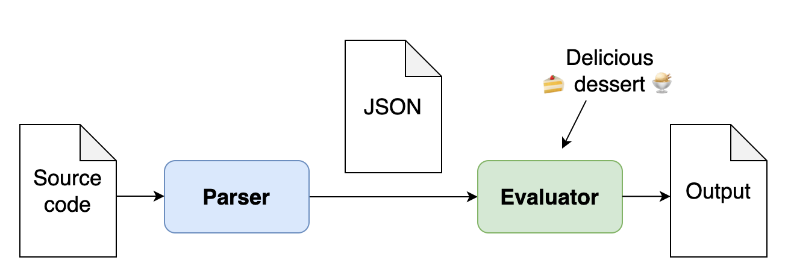
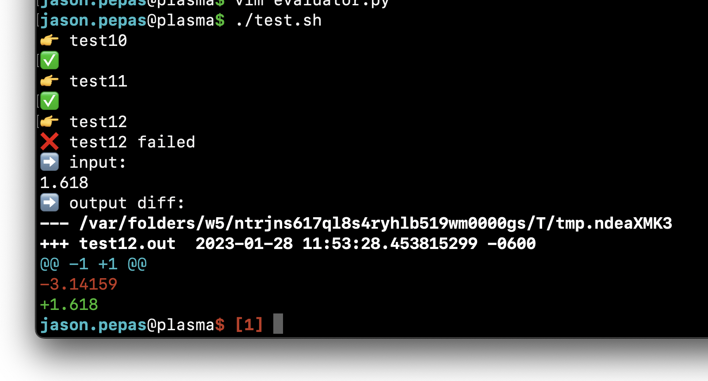

# Zero to Fibonacci: A Scheme interpreter crash course in five parts

Here's a bit of exercise for your programming muscles!

[](https://en.wikipedia.org/wiki/Structure_and_Interpretation_of_Computer_Programs)


## Goal: Fibonacci

In this series, we will implement just enough of a [Scheme](https://en.wikipedia.org/wiki/Scheme_(programming_language))
interpreter to define a **fibonacci function**
and then call that function.

Specifically, this is the final test case in this course:

```scheme
(define fib
  (lambda (x)
    (if (< x 2)
        x
        (+ (fib (+ x -1)) (fib (+ x -2))))))
(fib 10)
```

## Approach: Focus on the evaluator

A language interpreter consists of two major parts:
- **Parsing** the source code into a syntax tree
- **Evaluating** the syntax tree

While both of these parts present challenging problems to solve,
parsing is a bit more tedious and less fun than implementing an evaluator.

Accordingly, we're going to skip our vegetables and jump straight to dessert
by **focusing on the evaluator** and using a provided parser.

We'll do this by representing the **syntax tree in JSON format**,
so that nearly any language can be used to implement the evaluator.




## Why Scheme?

This course is based on Scheme for one reason: it has the [least complex syntax](https://iainctduncan.github.io/learn-scheme-for-max/part_1.html) of any language,
consisting of just atoms and lists.

This will keep our JSON syntax tree representation simple
and avoid unnecessarily complicating the evaluator implementation.


## Structure: Five incremental test-driven steps

Each step of this course will add additional language features to the evaluator.
Unit tests are included to verify and/or test-drive your work.


### Step 1: Literals

This step will focus on:
- Reading in the JSON syntax tree from standard input or a file
- Evaluating (numeric) literals

Your interpreter will be capable of evaluating statements like:

```scheme
42
-3
1.618
```


### Step 2: Function calls

This step will focus on:
- Symbols
- The environment
- Built-in environment bindings
- Lists
- Built-in functions
- Function invocation

Your interpreter will be capable of evaluating statements like:

```scheme
pi
(+ 1 2)
```


### Step 3: Branching

This step will focus on:
- Booleans
- Truthiness
- Conditionals
- Branching

Your interpreter will be capable of evaluating statements like:

```scheme
#t  ; the true boolean literal
#f  ; the false boolean literal
(< 1 2)
(if (< 1 2) 3 4)
```


### Step 4: User-defined functions

This step will focus on:
- User-defined functions

Your interpreter will be capable of evaluating statements like:

```scheme
(lambda () 1)  ; a function which takes no arguments and returns 1
(lambda (x) x)  ; the identity function
(lambda (x) (if (< x 0) (- 0 x) x))  ; the absolute value function
```


### Step 5: Assignment

This step will focus on:
- User-defined environment bindings (a.k.a. assignment)

Your interpreter will be capable of evaluating statements like:

```scheme
(define x 42)
(define y x)
(define abs (lambda (x) (if (< x 0) (- 0 x) x)))
(define fib (lambda (x) (if (< x 2) x (+ (fib (+ x -1)) (fib (+ x -2))))))
(fib 10)
```


## The JSON syntax tree format

Your evaluator will operate on a JSON syntax tree.  Here's the format:

A (Scheme) source code program is a sequence of statements, so the outermost JSON component will be an array.

Each statement in the array will be a JSON object of the form:

```json
{
    "type": <number, symbol, or list>
    "value": <a literal or an array>
}
```

### Numeric literals

```
-1.618
```

```json
{
    "type": "number",
    "value": -1.618
}
```

### Symbols

```
+
```

```json
{
    "type": "symbol",
    "value": "+"
}
```

### Lists

```scheme
(+ 1 2)
```

```json
{
    "type": "list",
    "value": [
        {
            "type": "symbol",
            "value": "+"
        },
        {
            "type": "number",
            "value": 1
        },
        {
            "type": "number",
            "value": 2
        }
    ]
}
```

### A complete program

```scheme
(define x 1)
(define y 2)
(define max (lambda (a b) (if (< a b) b a)))
(max x y)
```

```json
[
    {
        "type": "list",
        "value": [
            {
                "type": "symbol",
                "value": "define"
            },
            {
                "type": "symbol",
                "value": "x"
            },
            {
                "type": "number",
                "value": 1
            }
        ]
    },
    {
        "type": "list",
        "value": [
            {
                "type": "symbol",
                "value": "define"
            },
            {
                "type": "symbol",
                "value": "y"
            },
            {
                "type": "number",
                "value": 2
            }
        ]
    },
    {
        "type": "list",
        "value": [
            {
                "type": "symbol",
                "value": "define"
            },
            {
                "type": "symbol",
                "value": "max"
            },
            {
                "type": "list",
                "value": [
                    {
                        "type": "symbol",
                        "value": "lambda"
                    },
                    {
                        "type": "list",
                        "value": [
                            {
                                "type": "symbol",
                                "value": "a"
                            },
                            {
                                "type": "symbol",
                                "value": "b"
                            }
                        ]
                    },
                    {
                        "type": "list",
                        "value": [
                            {
                                "type": "symbol",
                                "value": "if"
                            },
                            {
                                "type": "list",
                                "value": [
                                    {
                                        "type": "symbol",
                                        "value": "<"
                                    },
                                    {
                                        "type": "symbol",
                                        "value": "a"
                                    },
                                    {
                                        "type": "symbol",
                                        "value": "b"
                                    }
                                ]
                            },
                            {
                                "type": "symbol",
                                "value": "b"
                            },
                            {
                                "type": "symbol",
                                "value": "a"
                            }
                        ]
                    }
                ]
            }
        ]
    },
    {
        "type": "list",
        "value": [
            {
                "type": "symbol",
                "value": "max"
            },
            {
                "type": "symbol",
                "value": "x"
            },
            {
                "type": "symbol",
                "value": "y"
            }
        ]
    }
]
```


## The parser

A rudimentary Scheme-to-JSON parsing script is included.
You can use it to test your evaluator without having to write a bunch of JSON by hand:

```
echo '(+ 1 2)' | ./parser.py | ./evaluator
```


## The tests

A series of tests are included to help verify your implementation.

Each test comes in the form of three files:
- The input source code (Scheme)
- The corresponding JSON syntax tree
- The expected evaluator output

Additionally, a Bash script is included which runs all of the tests.

```
$ ./test.sh 
👉 test10
✅
👉 test11
✅
👉 test12
✅
```

If your evaluator produces incorrect output, a diff will be displayed:


